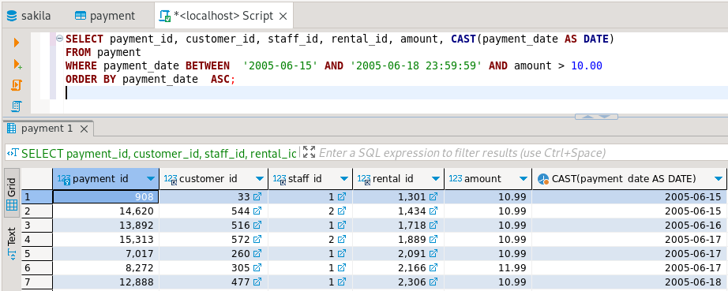

# 12-03_sql_part1

# Домашнее задание к занятию «SQL. Часть 1»

Задание можно выполнить как в любом IDE, так и в командной строке.

---

### Задание 1

Получите уникальные названия районов из таблицы с адресами, которые начинаются на **“K”** и заканчиваются на **“a”** и не содержат пробелов.

**Решение:**
```
SELECT DISTINCT district
FROM address
WHERE district LIKE 'K%a' AND district NOT LIKE 'K% %a';
```
<kbd></kbd> 

---

### Задание 2

Получите из таблицы **платежей** за прокат фильмов информацию по платежам, которые выполнялись в промежуток **с 15 июня 2005 года** 
по **18 июня 2005 года** **включительно** и стоимость которых превышает **10.00**.

**Решение:**
```
SELECT payment_id, customer_id, staff_id, rental_id, amount, CAST(payment_date AS DATE)
FROM payment
WHERE payment_date BETWEEN  '2005-06-15' AND '2005-06-18 23:59:59' AND amount > 10.00
ORDER BY payment_date  ASC;
```
<kbd></kbd>

---

### Задание 3

Получите последние пять аренд фильмов.

**Решение:**
```
SELECT rental_id, CAST(rental_date AS DATE),inventory_id, customer_id, staff_id 
FROM rental
ORDER BY rental_id DESC LIMIT 5;
```
<kbd></kbd> 

---

### Задание 4

Одним запросом получите активных покупателей, имена которых Kelly или Willie. 

Сформируйте вывод в результат таким образом:
- все буквы в фамилии и имени из верхнего регистра переведите в нижний регистр,
- замените буквы 'll' в именах на 'pp'.

**Решение:**
```
SELECT active, customer_id, REPLACE(LOWER(first_name) , 'll', 'pp'), LOWER(last_name)
FROM customer
WHERE active = 1 AND (first_name LIKE 'Kelly' OR first_name  LIKE 'Willie');
```
<kbd></kbd> 
